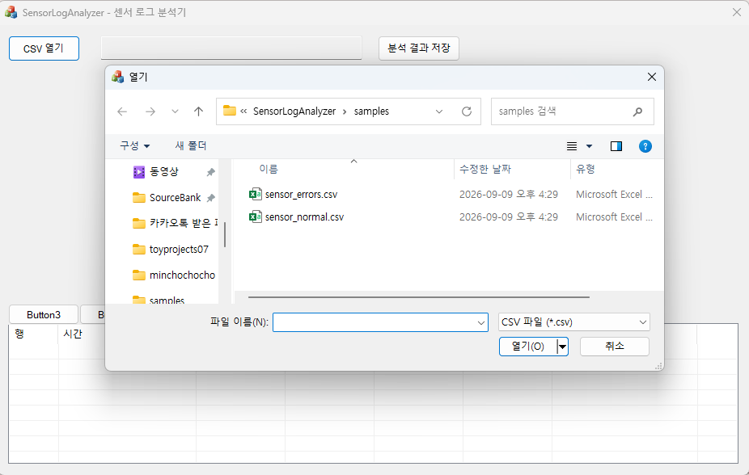
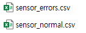
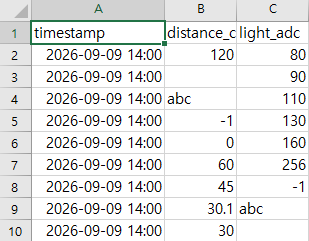
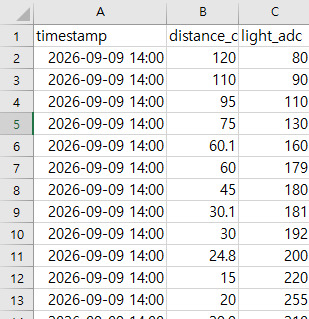
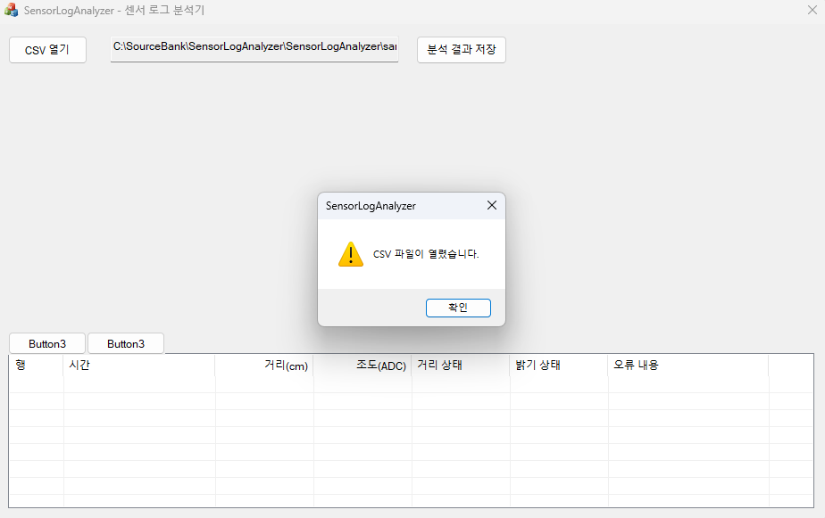
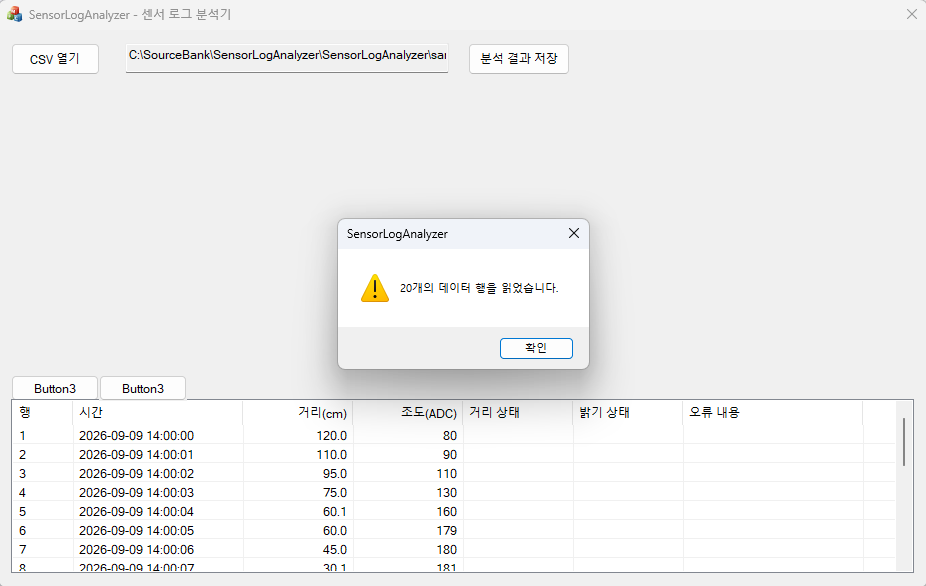

# SensorLogAnalyzer

거리·조도 센서의 CSV 기록을 불러와 그래프로 확인하고, 사용자가 설정한 기준에 따라 경고 구간을 분석하는 **MFC 기반 Windows 데스크톱 프로그램**을 개발합니다.

> 현재는 CSV 파일 선택, 헤더 검증, 데이터 행 분리와 목록 표시까지 구현한 상태입니다. 데이터 값 검증, 상태 판정, 그래프와 결과 저장 기능은 아직 구현하지 않았습니다.

## 개발 배경과 목적

라즈베리파이 주차 경고 시스템에서 다루는 거리·조도 데이터를 PC에서 검토할 수 있는 도구를 만드는 것이 목표입니다. 장비를 직접 연결하지 않고 저장된 기록을 분석하는 방식으로 시작합니다.

- 시간에 따른 센서 값의 변화 확인
- 위험 거리와 어두움 기준에 따른 상태 판정
- 누락값·잘못된 형식·측정 실패값 확인
- 분석 결과 저장을 통한 측정 기록 비교

이 프로젝트에서는 C++·MFC 화면 구성, 파일 입출력, 데이터 검증, 시각화와 판정 로직 구현을 다룹니다. 실시간 장비 통신은 초기 개발 범위에 포함하지 않습니다.

## 개발 환경

프로젝트 설정 파일에서 확인한 구성입니다.

- 언어: C++
- 프레임워크: MFC, 대화 상자 기반 (`CDialogEx`)
- 개발 도구: Visual Studio
- 플랫폼 도구 집합: `v145`
- 대상: Windows, Windows SDK `10.0` 계열
- 빌드 구성: Debug / Release, Win32 / x64
- 문자 집합: Unicode
- MFC 연결 방식: 공유 DLL
- 리소스 언어: 한국어

## 현재 진행 상태

- [X]  프로젝트 주제 및 초기 개발 범위 선정
- [X]  MFC 대화 상자 기반 프로젝트 생성
- [X]  로컬 Git 저장소 생성
- [X]  메인 화면 디자인 시안 작성
- [X]  초기 README 작성
- [X]  기본 화면 실행 및 목록 열 표시 확인 (개발자 수동 확인)
- [X]  CSV 열기·파일 경로·결과 저장 버튼·목록 컨트롤 배치
- [X]  CSV 파일 선택 대화 상자 및 선택한 경로 표시 구현
- [X]  List Control 변수 연결 및 7개 열 구성
- [X]  마지막 목록 열 인덱스를 6으로 수정 (소스 확인)
- [X]  정상·오류 검증용 모의 CSV 및 기대 결과 작성
- [X]  CSV 파일 열기, 첫 줄 읽기 및 헤더 형식 검증
- [X]  CSV 내용 읽기 및 앞 3개 필드 목록 표시 (개발자 수동 확인)
- [X]  목록 행 번호 서식 및 마지막 열 인덱스 수정 (소스 확인)
- [ ]  입력 데이터 검증 및 오류 목록 표시
- [ ]  거리·조도 그래프 표시
- [ ]  경고 기준 설정 및 판정
- [ ]  분석 결과 CSV 저장

개발자가 실행 화면에서 목록 열이 표시되는 것을 확인했습니다. 파일 선택·경로 표시 코드는 작성되어 있으며, 취소 동작과 한글·공백 경로에 대한 개별 테스트 결과는 아직 기록하지 않았습니다. 모든 빌드 구성에 대한 검증은 수행하지 않았습니다.

## 현재 구현한 기능

### 파일 선택 및 경로 표시

- `IDC_BUTTON_OPEN_CSV`의 클릭 이벤트를 `OnBnClickedButtonOpenCsv()`에 연결
- `CFileDialog`로 기존 파일 선택 창 표시
- CSV 파일 필터와 모든 파일 필터 제공
- 파일을 선택하면 `GetPathName()`으로 얻은 전체 경로를 `IDC_EDIT_FILE_PATH`에 표시
- 선택을 취소하면 처리 함수에서 바로 반환하도록 구현

현재는 선택한 파일을 열어 첫 줄이 `timestamp,distance_cm,light_adc`인지 확인합니다. 정상·오류 샘플 모두 동일한 정상 헤더를 사용하므로 두 파일에서 헤더 검증이 성공한 것을 개발자가 확인했습니다. 데이터 행의 형식과 값은 아직 검증하지 않습니다.

헤더 검증을 통과하면 빈 줄을 제외한 각 행을 쉼표로 나누고, 행 번호·시간·거리·조도의 앞 4개 목록 열에 표시합니다. 파일을 다시 선택할 때는 기존 목록을 지운 뒤 새 데이터를 표시합니다. 현재 파서는 단순한 3열 형식만 대상으로 하며 따옴표로 감싼 쉼표 등 일반 CSV 문법 전체를 지원하지 않습니다.

### 센서 데이터 목록

- `IDC_LIST_SENSOR_DATA`를 `CListCtrl m_sensorList`에 `DDX_Control`로 연결
- `OnInitDialog()`에서 목록 열 초기화
- 행 전체 선택, 격자선, 더블 버퍼링 스타일 설정
- 행, 시간, 거리(cm), 조도(ADC), 거리 상태, 밝기 상태, 오류 내용의 7개 열 추가

**수정 이력:** 마지막 `오류 내용` 열의 `InsertColumn()` 인덱스 중복을 `5`에서 `6`으로 수정했습니다. 현재 소스에서 수정 여부를 확인했으며, 수정 후 화면 순서는 별도로 확인합니다.

목록에 실제 데이터 행을 추가하는 기능과 분석 결과 저장 동작은 아직 구현하지 않았습니다.

## 화면 구성 계획

디자인 시안을 기준으로 다음 순서로 구성할 예정입니다. 시안은 실제 실행 화면이 아니며, 표시된 값은 예시입니다.

- **상단:** CSV 열기, 선택한 파일 경로, 분석 결과 저장
- **요약 영역:** 전체 행 수, 정상 행 수, 오류 행 수
- **중앙:** 시간에 따른 거리·조도 변화 그래프
- **오른쪽:** 주의 거리·위험 거리·어두움 기준 설정, 선택한 기록 상세
- **하단:** 전체 데이터와 오류 데이터 목록
- **상태 표시줄:** 파일 처리 상태와 데이터 출처 표시

거리 상태와 밝기 상태는 별도 열로 구성했으며, 각 상태를 판정하고 값을 표시하는 로직은 구현 예정입니다. 조도 데이터는 ADC 원시값으로 표시하며, 보정되지 않은 값을 조도 단위인 lux로 표기하지 않습니다.

## 데이터 처리 계획

초기 개발용 모의 CSV 두 종류를 준비했습니다. 실제 측정 데이터를 추가하면 출처, 측정 조건, 샘플링 간격을 함께 기록합니다.

- [정상 데이터](samples/sensor_normal.csv): 데이터 20행, 정상 20행·오류 0행 예상
- [오류 검증 데이터](samples/sensor_errors.csv): 데이터 20행, 정상 8행·오류 12행 예상
- [샘플 형식과 행별 오류 설명](samples/README.md): 입력 규칙, 경계값, 예상 판정 결과

위 수치는 샘플의 기대 결과이며 현재 MFC 프로그램의 처리 결과가 아닙니다. 위험 거리와 어두움은 센서 상태이며 데이터 형식 오류와 구분합니다.

- 기본 항목: 측정 시각, 거리(cm), 조도 ADC 원시값
- PCF8591 데이터 기준 ADC 범위: 0~255
- 초기 샘플 형식: UTF-8(BOM 없음), `timestamp,distance_cm,light_adc`, 시간 `YYYY-MM-DD HH:MM:SS`
- 초기 검증 범위: 유한한 거리 `0 < 거리 <= 400`, ADC 정수 `0~255`, 필수값 및 유효한 시각, 정확히 3개 열
- 정상 데이터와 오류 데이터를 구분하고, 그래프에서 제외한 데이터는 오류 목록에서 확인할 수 있도록 구현
- 주의·위험 거리와 밝기 판정 조건은 구현 시 문서화하고 경계값을 검증

## 개발 순서

1. **기본 실행 확인:** 생성된 프로젝트를 빌드하고 기본 대화 상자 확인
2. **CSV 불러오기:** 파일 선택 버튼, 경로 표시, 데이터 목록 구현
3. **데이터 검증:** 누락값·형식 오류·측정 실패값 검출
4. **그래프 표시:** 시간축을 공유하는 거리·조도 그래프 구현
5. **기준 적용 및 저장:** 경고 조건 변경, 재분석, 결과 CSV 저장

확장 후보로는 **기록 재생**과 **서로 다른 임계값을 적용한 결과 비교**를 고려합니다. 초기 기능을 완성한 후 추가 여부를 결정합니다.

## 프로젝트 구조

아래 경로는 이 README가 있는 Git 저장소 루트를 기준으로 합니다.

```text
SensorLogAnalyzer/
├─ README.md
├─ .gitignore
├─ SensorLogAnalyzer.slnx
└─ SensorLogAnalyzer/
   ├─ SensorLogAnalyzer.vcxproj
   ├─ SensorLogAnalyzer.cpp / .h       # 애플리케이션 진입 및 초기화
   ├─ SensorLogAnalyzerDlg.cpp / .h    # 메인 대화 상자
   ├─ SensorLogAnalyzer.rc            # 대화 상자 등 UI 리소스
   ├─ Resource.h                     # 리소스 ID
   ├─ pch.cpp / .h                    # 미리 컴파일된 헤더
   └─ res/                           # 아이콘 등 리소스
```

## 빌드·실행 절차

1. `v145` 도구 집합, 해당 MFC 구성 요소 및 Windows SDK가 설치된 Visual Studio에서 `SensorLogAnalyzer.slnx`를 엽니다.
2. 구성은 `Debug`, 플랫폼은 `x64`를 선택합니다.
3. 솔루션을 빌드합니다.
4. `Ctrl+F5`로 실행해 메인 대화 상자와 목록 열을 확인합니다.

실행 및 목록 표시 여부는 개발자가 수동으로 확인했습니다. 문서 갱신 과정에서 별도의 빌드·실행은 수행하지 않았습니다.

### 현재 단계의 확인 항목

- [X]  실행 화면에 목록 열 표시 (개발자 확인)
- [X]  CSV 파일 선택 후 전체 경로 표시 확인 (개발자 확인)
- [X]  정상·오류 샘플 파일 열기 및 헤더 검증 (개발자 확인)
- [X]  CSV 데이터 행 읽기 및 목록 표시 (개발자 확인)
- [X]  행 번호 서식 문자열을 `%d`로 수정 (소스 확인)
- [ ]  파일 선택 취소 시 기존 경로 유지 확인
- [ ]  한글·공백이 포함된 파일 경로 표시 확인
- [X]  마지막 열 인덱스를 `6`으로 수정 (소스 확인)
- [ ]  실행 화면에서 7개 열 순서와 `1~20` 행 번호 확인
- [ ]  가로 스크롤로 오른쪽 열까지 확인

## 개발 기록

### 2026-09-09 — 프로젝트 준비 및 화면 기획

- 센서 로그 분석 도구를 MFC 포트폴리오 주제로 선정
- 장비 연결 없이 CSV 기록을 분석하는 방식으로 초기 범위 결정
- MFC 대화 상자 기반 프로젝트와 로컬 Git 저장소 생성
- 파일 열기·그래프·분석 기준·데이터 목록으로 구성된 화면 시안 작성
- 생성된 소스와 프로젝트 설정을 확인하여 초기 README 작성
- 후속 단계에서 기본 실행, CSV 선택과 목록 표시까지 구현

### 2026-09-09 — 파일 선택 기능 및 목록 구성

- 메인 화면에 CSV 열기 버튼, 파일 경로 영역, 분석 결과 저장 버튼과 하단 목록 배치
- List Box와 List Control의 차이를 확인하고 데이터 표에 사용할 컨트롤을 List Control로 변경
- CSV 열기 버튼에 파일 선택 및 경로 표시 코드 작성
- 목록에 `m_sensorList` 변수 연결 및 7개 열 구성
- 개발자가 실행 화면에서 목록 열 표시 확인
- 소스 점검에서 발견한 마지막 열 인덱스 중복을 후속 단계에서 `5`에서 `6`으로 수정



### 2026-09-09 — 모의 CSV 준비

- 마지막 목록 열 인덱스가 6으로 수정된 것을 소스에서 확인
- 정상 데이터 20행과 오류 검증 데이터 20행 작성
- 오류 파일에 누락값, 숫자 형식 오류, 범위 위반, 잘못된 시각 및 열 수 오류 포함
- 샘플 설명에 행별 오류 원인과 판정 기대값 기록
- 후속 단계에서 CSV 내용을 읽어 데이터 목록에 행 추가





- sensor_error.csv



- sensor_normal.csv

### 2026-09-09 — CSV 헤더 읽기 및 검증

- `CStdioFile`로 선택한 CSV 파일 열기
- 빈 파일과 파일 열기 실패 처리 추가
- 첫 줄을 읽어 `timestamp,distance_cm,light_adc`와 비교
- 정상·오류 샘플 모두 헤더 검증 성공을 개발자가 확인
- 후속 단계에서 데이터 행 분리와 목록 표시 구현




### 2026-09-09 — CSV 데이터 목록 표시

- 헤더 검증을 통과한 파일의 나머지 행을 끝까지 읽는 반복 처리 구현
- 쉼표를 기준으로 시간·거리·조도 필드를 분리해 List Control에 표시
- 새 파일을 불러오기 전에 기존 목록 행을 삭제하도록 처리
- 개발자가 CSV 데이터가 읽히는 것을 실행 화면에서 확인
- 행 번호 서식 문자열을 `"%d"`로 수정한 것을 소스에서 확인
- 다음 작업: 실행 화면에서 행 번호 확인 후 데이터 형식·범위 검증 및 오류 내용 표시




각 단계가 끝나면 구현 기능, 확인한 동작, 발견한 문제와 해결 방법, 실제 화면 캡처를 이 문서에 추가합니다. 코드 작성 여부와 동작 확인 여부를 구분하여 기록합니다.
