# SensorLogAnalyzer

거리·조도 센서의 CSV 기록을 불러와 그래프로 확인하고, 사용자가 설정한 기준에 따라 경고 구간을 분석하는 **MFC 기반 Windows 데스크톱 프로그램**을 개발합니다.

> 현재는 CSV 파일 선택·검증·목록 표시, 정상·오류 집계, 거리·조도 상태 판정, 전체·유효·오류 탭 필터와 CSV 기반 거리·조도 선 그래프를 구현했습니다. 경고 기준 변경과 분석 결과 저장 기능은 아직 남아 있습니다.

## 개발 배경과 목적

라즈베리파이 주차 경고 시스템에서 다루는 거리·조도 데이터를 PC에서 검토할 수 있는 도구를 만드는 것이 목표입니다. 장비를 직접 연결하지 않고 저장된 기록을 분석하는 방식으로 시작합니다.

- 시간에 따른 센서 값의 변화 확인
- 위험 거리와 어두움 기준에 따른 상태 판정
- 누락값·잘못된 형식·측정 실패값 확인
- 분석 결과 저장을 통한 측정 기록 비교

이 프로젝트에서는 C++·MFC 화면 구성, 파일 입출력, 데이터 검증, 시각화와 판정 로직 구현을 다룹니다. 실시간 장비 통신은 초기 개발 범위에 포함하지 않습니다.

## 개발 환경

프로젝트 설정 파일에서 확인한 구성입니다.

- 언어: C++
- 프레임워크: MFC, 대화 상자 기반 (`CDialogEx`)
- 개발 도구: Visual Studio
- 플랫폼 도구 집합: `v145`
- 대상: Windows, Windows SDK `10.0` 계열
- 빌드 구성: Debug / Release, Win32 / x64
- 문자 집합: Unicode
- MFC 연결 방식: 공유 DLL
- 리소스 언어: 한국어

## 현재 진행 상태

- [X]  프로젝트 주제 및 초기 개발 범위 선정
- [X]  MFC 대화 상자 기반 프로젝트 생성
- [X]  로컬 Git 저장소 생성
- [X]  메인 화면 디자인 시안 작성
- [X]  초기 README 작성
- [X]  기본 화면 실행 및 목록 열 표시 확인 (개발자 수동 확인)
- [X]  CSV 열기·파일 경로·결과 저장 버튼·목록 컨트롤 배치
- [X]  CSV 파일 선택 대화 상자 및 선택한 경로 표시 구현
- [X]  List Control 변수 연결 및 7개 열 구성
- [X]  마지막 목록 열 인덱스를 6으로 수정 (소스 확인)
- [X]  정상·오류 검증용 모의 CSV 및 기대 결과 작성
- [X]  CSV 파일 열기, 첫 줄 읽기 및 헤더 형식 검증
- [X]  CSV 내용 읽기 및 앞 3개 필드 목록 표시 (개발자 수동 확인)
- [X]  목록 행 번호 서식 및 마지막 열 인덱스 수정 (소스 확인)
- [X]  열 개수·누락값·숫자 형식·센서 범위 검증 코드 구현 (소스 확인)
- [X]  오류 샘플에서 검증 오류 표시 확인 (개발자 수동 확인)
- [X]  날짜·시간 형식 및 유효 범위 검증
- [X]  전체·정상·오류 행 집계 및 샘플 기대값 비교
- [X]  유효한 데이터의 거리·조도 상태 판정 및 목록 표시 (소스 확인)
- [X]  전체·유효·오류 데이터 탭과 목록 필터 구현 (소스 확인)
- [X]  거리·조도 그래프 컨트롤, 격자와 데이터 선 구현 (빌드 확인)
- [X]  CSV의 유효한 거리·조도 값을 그래프에 연결 (개발자 실행 확인)
- [X]  그래프 세로축 눈금값 표시와 오류 구간 선 단절 (개발자 실행 확인)
- [X]  그래프 가로축의 처음·중간·마지막 측정 시각 표시 (빌드 확인)
- [ ]  경고 기준을 화면에서 변경하고 다시 판정하는 기능
- [ ]  분석 결과 CSV 저장

개발자가 실행 화면에서 목록 열, CSV 데이터와 검증 오류가 표시되는 것을 확인했습니다. 정상 샘플은 전체 20행·정상 20행·오류 0행, 오류 샘플은 전체 20행·정상 8행·오류 12행으로 집계되어 준비한 기대값과 일치했습니다. 파일 선택 취소, 한글·공백 경로 및 모든 빌드 구성은 별도로 검증하지 않았습니다.

## 현재 구현한 기능

### 파일 선택 및 경로 표시

- `IDC_BUTTON_OPEN_CSV`의 클릭 이벤트를 `OnBnClickedButtonOpenCsv()`에 연결
- `CFileDialog`로 기존 파일 선택 창 표시
- CSV 파일 필터와 모든 파일 필터 제공
- 파일을 선택하면 `GetPathName()`으로 얻은 전체 경로를 `IDC_EDIT_FILE_PATH`에 표시
- 선택을 취소하면 처리 함수에서 바로 반환하도록 구현

선택한 파일을 열어 첫 줄이 `timestamp,distance_cm,light_adc`인지 확인합니다. 정상·오류 샘플 모두 동일한 정상 헤더를 사용하므로 두 파일에서 헤더 검증이 성공한 것을 개발자가 확인했습니다.

헤더 검증을 통과하면 빈 줄을 제외한 각 행을 쉼표로 나누고, 행 번호·시간·거리·조도의 앞 4개 목록 열에 표시합니다. 파일을 다시 선택할 때는 기존 목록을 지운 뒤 새 데이터를 표시합니다. 현재 파서는 단순한 3열 형식만 대상으로 하며 따옴표로 감싼 쉼표 등 일반 CSV 문법 전체를 지원하지 않습니다.

### 센서 데이터 목록

- `IDC_LIST_SENSOR_DATA`를 `CListCtrl m_sensorList`에 `DDX_Control`로 연결
- `OnInitDialog()`에서 목록 열 초기화
- 행 전체 선택, 격자선, 더블 버퍼링 스타일 설정
- 행, 시간, 거리(cm), 조도(ADC), 거리 상태, 밝기 상태, 오류 내용의 7개 열 추가

**수정 이력:** 마지막 `오류 내용` 열의 `InsertColumn()` 인덱스 중복을 `5`에서 `6`으로 수정했습니다. 현재 소스에서 수정 여부를 확인했으며, 수정 후 화면 순서는 별도로 확인합니다.

### 데이터 검증

- 쉼표가 정확히 2개인지 확인하여 3열 형식 검증
- 시간·거리·조도 필드의 누락 여부 확인
- `_tcstod()`로 거리 문자열 전체가 유한한 실수인지 확인
- 거리 허용 범위 `0 < 거리 <= 400` 확인
- `_tcstol()`로 조도 문자열 전체가 정수인지 확인
- 조도 ADC 허용 범위 `0~255` 확인
- 처음 발견한 오류 원인을 목록의 `오류 내용` 열에 표시

### 날짜·시간 검증

- 입력 길이가 정확히 19자인지 확인
- `yyyy-MM-dd HH:mm:ss` 위치의 하이픈·공백·콜론 구분자 확인
- 구분자를 제외한 문자가 모두 숫자인지 확인
- 문자열을 `SYSTEMTIME`으로 변환
- `SystemTimeToFileTime()`으로 존재하지 않는 날짜와 유효하지 않은 시각 확인
- 오류가 있으면 `시간 형식 또는 범위 오류` 표시

처음 구현할 때 날짜와 시간 사이의 공백 및 시각의 콜론 위치를 하이픈으로 검사해 정상 행 전체가 오류로 판정되었습니다. 실제 입력 구조에 맞게 10번 위치는 공백, 13·16번 위치는 콜론으로 수정했습니다. 수정 후 개발자가 정상 동작을 확인했습니다.

### 거리·조도 상태 판정

입력 검증을 통과한 행에만 다음 기준을 적용해 `거리 상태`와 `밝기 상태` 열에 표시합니다.

- 거리 `0 < 값 <= 30cm`: `위험`
- 거리 `30cm < 값 <= 60cm`: `주의`
- 거리 `60cm < 값 <= 400cm`: `안전`
- 조도 ADC `0~189`: `밝음`
- 조도 ADC `190~255`: `어두움`

판정 함수 `GetDistanceStatus()`와 `GetLightStatus()` 및 목록의 4·5번 열 출력 연결을 소스에서 확인했습니다. 오류가 있는 행은 두 상태를 비워 두고 `오류 내용`만 표시합니다. `위험`과 `어두움`은 정상적으로 측정된 값의 상태이며 데이터 형식 오류에 포함하지 않습니다. 실행 화면에서 경계값 `30`, `60`, `189`, `190`의 표시 결과는 아직 별도로 기록하지 않았습니다.

분석 결과 저장은 아직 구현하지 않았습니다.

### 검증 결과 집계

- 빈 줄을 제외하고 처리한 데이터 수를 전체 행으로 집계
- `errorMessage`가 비어 있으면 정상 행, 오류 문구가 있으면 오류 행으로 집계
- 파일 처리가 끝나면 전체·정상·오류 행 수를 메시지 박스로 표시
- 정상 샘플 실행 결과: 전체 20행, 정상 20행, 오류 0행
- 오류 샘플 실행 결과: 전체 20행, 정상 8행, 오류 12행

위 결과는 개발자가 앱을 실행해 확인했습니다. 현재 집계는 메시지 박스로 표시하며, 최종 화면에서는 상단 요약 영역으로 옮길 예정입니다.

### 목록 탭 필터

- `CTabCtrl`에 `전체 데이터`, `유효 데이터`, `오류 데이터` 탭 구성
- CSV에서 읽은 각 행을 `SensorRecord`와 `std::vector`에 보관
- `RefreshSensorList()`가 선택된 탭에 맞는 행만 List Control에 다시 표시
- 유효 데이터는 `errorMessage`가 비어 있는 행, 오류 데이터는 오류 문구가 있는 행으로 구분
- 필터링된 목록에서도 원본 CSV의 데이터 행 번호 유지

오류 샘플을 기준으로 전체 20행·유효 8행·오류 12행이 표시되어야 합니다. 필터 함수와 탭 이벤트 연결은 소스에서 확인했으며, 각 탭의 실제 표시 행 수는 실행 화면으로 별도 확인합니다.

### 거리·조도 그래프 기반

- `CStatic`을 상속한 `CSensorGraphCtrl` 사용자 지정 컨트롤 추가
- 거리·조도 Picture Control을 `SS_OWNERDRAW`로 설정하고 각각 그래프 객체에 DDX 연결
- 흰색 배경, 점선 격자와 그래프 외곽선 표시
- `SetData()`로 값 범위와 선 색상을 전달하고 `Invalidate()`로 다시 그리기 요청
- 값을 그래프 좌표로 변환한 뒤 GDI `MoveTo()`와 `LineTo()`로 선 표시
- 거리 그래프는 최대 `400`, 조도 그래프는 최대 `255`를 고정 축 범위로 사용
- 거리에는 파란색, 조도에는 주황색 데이터 선 적용
- 그래프 왼쪽에 최댓값부터 0까지 5등분한 세로축 눈금값 표시
- `SensorRecord`에 변환된 거리·조도 숫자값과 유효 여부를 함께 보관
- `RefreshGraphs()`에서 CSV의 모든 행 순서를 유지하고 오류 행에는 `NaN` 전달
- `DrawItem()`이 유한한 값만 좌표로 변환하고 `NaN`을 만나면 현재 선을 종료
- 각 레코드의 유효한 시각에서 `HH:mm:ss` 부분을 추출해 그래프 컨트롤에 전달
- 가로축에 처음·중간·마지막 위치의 시각을 좌·중앙·우측 정렬로 표시

처음에는 `OnInitDialog()`의 하드코딩 값으로 선 그리기를 확인한 뒤 임시 값을 제거하고 CSV 데이터로 교체했습니다. 정상·오류·경계값 샘플을 열었을 때 서로 다른 선과 세로축 값이 표시되는 것을 개발자가 실행 화면에서 확인했습니다. 오류 행의 가로 위치는 유지되며 그 지점에서 선이 끊깁니다. 가로축은 CSV 데이터 행의 순서를 기준으로 배치하고 처음·중간·마지막 위치에 유효한 측정 시각이 있을 때 `HH:mm:ss`를 표시합니다. 시각이 잘못되거나 누락된 위치는 빈 레이블로 남깁니다.

## 화면 구성 계획

디자인 시안을 기준으로 다음 순서로 구성할 예정입니다. 시안은 실제 실행 화면이 아니며, 표시된 값은 예시입니다.

- **상단:** CSV 열기, 선택한 파일 경로, 분석 결과 저장
- **요약 영역:** 전체 행 수, 정상 행 수, 오류 행 수
- **중앙:** 시간에 따른 거리·조도 변화 그래프
- **오른쪽:** 주의 거리·위험 거리·어두움 기준 설정, 선택한 기록 상세
- **하단:** 전체 데이터와 오류 데이터 목록
- **상태 표시줄:** 파일 처리 상태와 데이터 출처 표시

거리 상태와 밝기 상태는 별도 열로 구성했으며, 입력 검증을 통과한 행에 판정 결과를 표시합니다. 조도 데이터는 ADC 원시값으로 표시하며, 보정되지 않은 값을 조도 단위인 lux로 표기하지 않습니다.

## 데이터 처리 계획

초기 개발용 모의 CSV 두 종류를 준비했습니다. 실제 측정 데이터를 추가하면 출처, 측정 조건, 샘플링 간격을 함께 기록합니다.

- [정상 데이터](samples/sensor_normal.csv): 데이터 20행, 정상 20행·오류 0행 예상
- [오류 검증 데이터](samples/sensor_errors.csv): 데이터 20행, 정상 8행·오류 12행 예상
- [샘플 형식과 행별 오류 설명](samples/README.md): 입력 규칙, 경계값, 예상 판정 결과

위 기대값과 현재 MFC 프로그램의 실행 결과가 일치하는 것을 개발자가 확인했습니다. 위험 거리와 어두움은 센서 상태이며 데이터 형식 오류와 구분합니다.

- 기본 항목: 측정 시각, 거리(cm), 조도 ADC 원시값
- PCF8591 데이터 기준 ADC 범위: 0~255
- 초기 샘플 형식: UTF-8(BOM 없음), `timestamp,distance_cm,light_adc`, 시간 `YYYY-MM-DD HH:MM:SS`
- 초기 검증 범위: 유한한 거리 `0 < 거리 <= 400`, ADC 정수 `0~255`, 필수값 및 유효한 시각, 정확히 3개 열
- 정상 데이터와 오류 데이터를 구분하고, 그래프에서 제외한 데이터는 오류 목록에서 확인할 수 있도록 구현
- 현재 판정 기준: 거리 `30cm` 이하 위험, `60cm` 이하 주의, 그 외 안전 / 조도 ADC `190` 이상 어두움, 그 외 밝음
- 후속 단계에서 화면 입력값으로 판정 기준을 변경하고 경계값을 검증

## 개발 순서

1. **기본 실행 확인:** 생성된 프로젝트를 빌드하고 기본 대화 상자 확인
2. **CSV 불러오기:** 파일 선택 버튼, 경로 표시, 데이터 목록 구현
3. **데이터 검증:** 누락값·형식 오류·측정 실패값 검출
4. **그래프 표시:** 사용자 지정 그래프 컨트롤 구현 후 CSV의 유효한 거리·조도 값 연결
5. **기준 적용 및 저장:** 경고 조건 변경, 재분석, 결과 CSV 저장

확장 후보로는 **기록 재생**과 **서로 다른 임계값을 적용한 결과 비교**를 고려합니다. 초기 기능을 완성한 후 추가 여부를 결정합니다.

## 프로젝트 구조

아래 경로는 이 README가 있는 Git 저장소 루트를 기준으로 합니다.

```text
SensorLogAnalyzer/
├─ README.md
├─ .gitignore
├─ SensorLogAnalyzer.slnx
├─ samples/
│  ├─ sensor_normal.csv
│  ├─ sensor_errors.csv
│  └─ sensor_boundaries.csv
└─ SensorLogAnalyzer/
   ├─ SensorLogAnalyzer.vcxproj
   ├─ SensorLogAnalyzer.cpp / .h       # 애플리케이션 진입 및 초기화
   ├─ SensorLogAnalyzerDlg.cpp / .h    # 메인 대화 상자
   ├─ SensorGraphCtrl.cpp / .h          # 거리·조도 선 그래프 컨트롤
   ├─ SensorLogAnalyzer.rc            # 대화 상자 등 UI 리소스
   ├─ Resource.h                     # 리소스 ID
   ├─ pch.cpp / .h                    # 미리 컴파일된 헤더
   └─ res/                           # 아이콘 등 리소스
```

## 빌드·실행 절차

1. `v145` 도구 집합, 해당 MFC 구성 요소 및 Windows SDK가 설치된 Visual Studio에서 `SensorLogAnalyzer.slnx`를 엽니다.
2. 구성은 `Debug`, 플랫폼은 `x64`를 선택합니다.
3. 솔루션을 빌드합니다.
4. `Ctrl+F5`로 실행해 메인 대화 상자와 목록 열을 확인합니다.

실행 및 목록 표시 여부는 개발자가 수동으로 확인했습니다. 문서 갱신 과정에서 별도의 빌드·실행은 수행하지 않았습니다.

### 현재 단계의 확인 항목

- [X]  실행 화면에 목록 열 표시 (개발자 확인)
- [X]  CSV 파일 선택 후 전체 경로 표시 확인 (개발자 확인)
- [X]  정상·오류 샘플 파일 열기 및 헤더 검증 (개발자 확인)
- [X]  CSV 데이터 행 읽기 및 목록 표시 (개발자 확인)
- [X]  행 번호 서식 문자열을 `%d`로 수정 (소스 확인)
- [ ]  파일 선택 취소 시 기존 경로 유지 확인
- [ ]  한글·공백이 포함된 파일 경로 표시 확인
- [X]  마지막 열 인덱스를 `6`으로 수정 (소스 확인)
- [ ]  실행 화면에서 7개 열 순서와 `1~20` 행 번호 확인
- [ ]  가로 스크롤로 오른쪽 열까지 확인
- [ ]  정상 샘플에서 오류 내용이 모두 비어 있는지 확인
- [X]  오류 샘플에서 검증 오류 문구 표시 확인 (개발자 확인)
- [X]  잘못된 시간 값 검출 및 정상 시각의 오판정 해소 (개발자 확인)
- [X]  정상 파일에서 전체 20행·정상 20행·오류 0행 확인
- [X]  오류 파일에서 전체 20행·정상 8행·오류 12행 확인
- [X]  거리·조도 상태 판정 함수와 목록 출력 연결 (소스 확인)
- [X]  정상 샘플에서 거리·조도 상태 표시 확인 (개발자 확인)
- [X]  오류 행의 거리·조도 상태가 비어 있는지 확인 (개발자 확인)
- [X]  판정 경계값 `30`, `60`, `189`, `190` 확인 (개발자 확인)
- [ ]  오류 샘플의 전체·유효·오류 탭에서 각각 20·8·12행 확인
- [X]  그래프 클래스, Owner Draw 컨트롤과 임시 데이터 선 코드 빌드
- [X]  실행 화면에서 두 임시 선 그래프 표시 확인 (개발자 확인)
- [X]  그래프에 CSV 유효 데이터 연결 (개발자 확인)
- [X]  그래프의 세로축 눈금값 표시 (개발자 확인)
- [X]  오류 행 위치에서 그래프 선을 끊어 누락 구간 표현 (개발자 확인)
- [X]  그래프의 시간축 눈금 코드 구현 및 Debug x64 빌드
- [ ]  실행 화면에서 처음·중간·마지막 시간 레이블 확인 및 캡처 추가

## 개발 기록

### 2026-09-09 — 프로젝트 준비 및 화면 기획

- 센서 로그 분석 도구를 MFC 포트폴리오 주제로 선정
- 장비 연결 없이 CSV 기록을 분석하는 방식으로 초기 범위 결정
- MFC 대화 상자 기반 프로젝트와 로컬 Git 저장소 생성
- 파일 열기·그래프·분석 기준·데이터 목록으로 구성된 화면 시안 작성
- 생성된 소스와 프로젝트 설정을 확인하여 초기 README 작성
- 후속 단계에서 기본 실행, CSV 선택과 목록 표시까지 구현

### 2026-09-09 — 파일 선택 기능 및 목록 구성

- 메인 화면에 CSV 열기 버튼, 파일 경로 영역, 분석 결과 저장 버튼과 하단 목록 배치
- List Box와 List Control의 차이를 확인하고 데이터 표에 사용할 컨트롤을 List Control로 변경
- CSV 열기 버튼에 파일 선택 및 경로 표시 코드 작성
- 목록에 `m_sensorList` 변수 연결 및 7개 열 구성
- 개발자가 실행 화면에서 목록 열 표시 확인
- 소스 점검에서 발견한 마지막 열 인덱스 중복을 후속 단계에서 `5`에서 `6`으로 수정


### 2026-09-09 — 모의 CSV 준비

- 마지막 목록 열 인덱스가 6으로 수정된 것을 소스에서 확인
- 정상 데이터 20행과 오류 검증 데이터 20행 작성
- 오류 파일에 누락값, 숫자 형식 오류, 범위 위반, 잘못된 시각 및 열 수 오류 포함
- 샘플 설명에 행별 오류 원인과 판정 기대값 기록
- 후속 단계에서 CSV 내용을 읽어 데이터 목록에 행 추가


- sensor_error.csv


- sensor_normal.csv

### 2026-09-09 — CSV 헤더 읽기 및 검증

- `CStdioFile`로 선택한 CSV 파일 열기
- 빈 파일과 파일 열기 실패 처리 추가
- 첫 줄을 읽어 `timestamp,distance_cm,light_adc`와 비교
- 정상·오류 샘플 모두 헤더 검증 성공을 개발자가 확인
- 후속 단계에서 데이터 행 분리와 목록 표시 구현


### 2026-09-09 — CSV 데이터 목록 표시

- 헤더 검증을 통과한 파일의 나머지 행을 끝까지 읽는 반복 처리 구현
- 쉼표를 기준으로 시간·거리·조도 필드를 분리해 List Control에 표시
- 새 파일을 불러오기 전에 기존 목록 행을 삭제하도록 처리
- 개발자가 CSV 데이터가 읽히는 것을 실행 화면에서 확인
- 행 번호 서식 문자열을 `"%d"`로 수정한 것을 소스에서 확인
- 후속 단계에서 행 번호 서식과 데이터 형식·범위 검증 코드 추가


### 2026-09-10 — 숫자 형식 및 센서 범위 검증

- 열 개수와 필수값 누락 검사 추가
- 거리 변환용 `TryParseDistance()`와 ADC 변환용 `TryParseAdc()` 구현
- 변환 시 입력 문자열 전체 소비 여부와 `ERANGE` 확인
- 거리 값의 유한성 및 `0 < 거리 <= 400` 범위 검사
- ADC 값의 정수 형식 및 `0~255` 범위 검사
- 검출한 원인을 List Control의 `오류 내용` 열에 표시
- 구현 코드를 소스에서 확인하고 개발자가 오류 표시 동작을 확인
- 후속 단계에서 날짜·시간 유효성 검사 구현

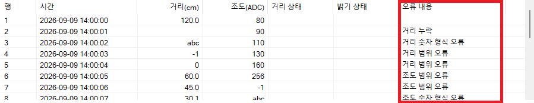

### 2026-09-10 — 날짜·시간 유효성 검증

- `yyyy-MM-dd HH:mm:ss` 길이, 구분자 위치와 숫자 구성 검사 추가
- 각 항목을 `SYSTEMTIME`으로 변환하고 Windows API로 실제 날짜·시간 범위 확인
- 초기 구분자 검사에서 공백과 콜론 위치를 하이픈으로 비교해 모든 행이 시간 오류로 판정되는 문제 발견
- 10번 위치를 공백, 13·16번 위치를 콜론 검사로 수정
- 개발자가 수정 후 정상 시각과 오류 시각이 구분되는 것을 확인
- 후속 단계에서 정상·오류 행 개수 집계 구현

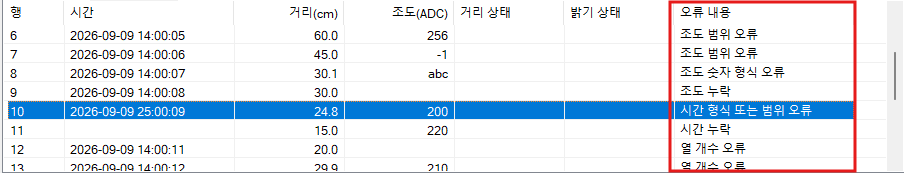

### 2026-09-10 — 정상·오류 행 집계

- 전체 행, 정상 행과 오류 행 카운터 추가
- 오류 문구의 유무를 기준으로 정상·오류 행 분류
- 파일 처리 후 세 집계값을 메시지 박스로 표시
- 정상 샘플에서 `전체 20 / 정상 20 / 오류 0` 확인
- 오류 샘플에서 `전체 20 / 정상 8 / 오류 12` 확인
- 다음 작업: 유효한 데이터에 거리 상태와 밝기 상태 판정 적용

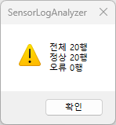

- 정상 샘플

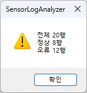

- 오류 샘플

### 2026-09-10 — 거리·조도 상태 판정

- 유효한 거리 값을 `위험`, `주의`, `안전`으로 분류하는 `GetDistanceStatus()` 추가
- 유효한 조도 ADC 값을 `밝음`, `어두움`으로 분류하는 `GetLightStatus()` 추가
- 거리 기준은 `30cm`와 `60cm`, 어두움 기준은 ADC `190`으로 설정
- 입력 오류가 없는 행에만 상태를 계산하여 목록의 `거리 상태`, `밝기 상태` 열에 표시
- 오류 행은 상태 열을 비워 데이터 오류와 센서 상태를 구분
- 구현과 목록 출력 연결은 소스에서 확인했으며 실행 화면 및 경계값 동작은 후속 확인 예정

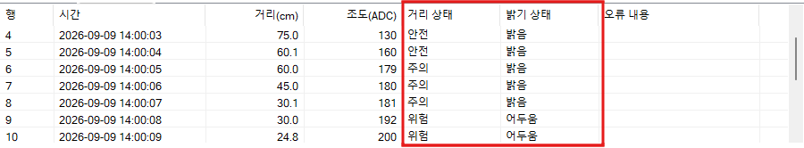

- 정상 샘플 - 거리, 밝기 상태가 잘 나오는 모습

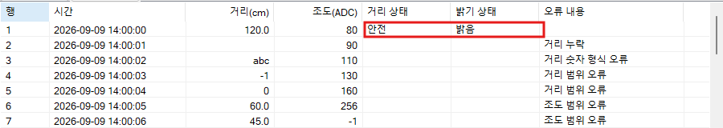

- 오류 샘플 - 오류가 없는 행만 상태 표시

### 2026-09-11 — 목록 탭 필터와 경계값 확인

- 목록 영역을 감싸는 Tab Control 추가
- `전체 데이터`, `유효 데이터`, `오류 데이터`의 3개 탭 구성
- CSV 레코드를 `std::vector<SensorRecord>`에 유지하고 탭 선택에 따라 목록을 다시 구성
- 경계값 검증용 `sensor_boundaries.csv` 추가
- 거리 `30`, `30.1`, `60`, `60.1`과 조도 ADC `189`, `190`의 판정 결과 확인
- 경계값 샘플에서 전체 4행·정상 4행·오류 0행 확인
- 오류 샘플의 탭별 행 수는 후속 실행 확인 예정

### 2026-09-11 — 사용자 지정 그래프 기반 구현

- 거리·조도 Group Box와 Owner Draw Picture Control 배치
- `CSensorGraphCtrl` 클래스와 두 그래프 컨트롤의 DDX 연결 추가
- 그래프 배경, 점선 격자, 외곽선과 데이터 선 그리기 구현
- `SetData()`에서 값·최댓값·선 색상을 저장하고 컨트롤 다시 그리기 처리
- 임시 거리 6개와 조도 6개 값으로 `Polyline()` 좌표 생성
- 누락된 `CAboutDlg::DoDataExchange()` 기본 구현을 복구해 링커 오류 해결
- Debug x64 명령줄 빌드 성공
- 임시 값으로 두 선의 색상과 좌표 변환 결과 확인

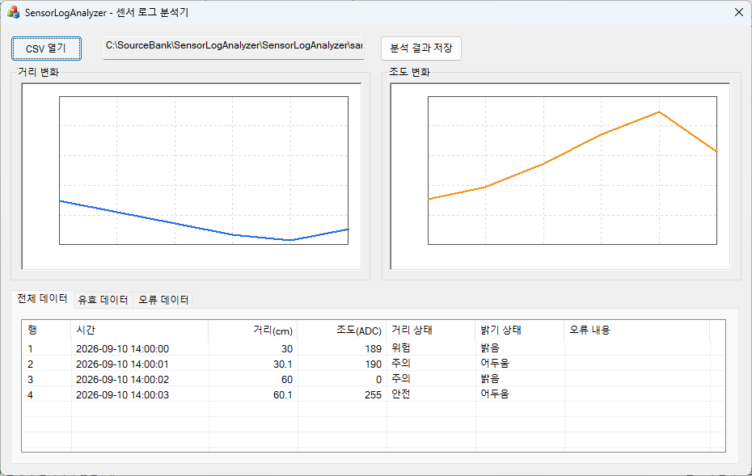

- 임시 거리·조도 데이터로 선 그래프 표시

### 2026-09-11 — CSV 센서 데이터 그래프 연결

- `SensorRecord`에 검증을 마친 거리·조도 숫자값과 `isValid` 상태 추가
- CSV 처리가 끝나면 `RefreshGraphs()`를 호출하도록 연결
- 유효한 행의 거리값은 최대 400 범위의 파란색 선으로 표시
- 유효한 행의 조도값은 최대 255 범위의 주황색 선으로 표시
- 정상·오류·경계값 샘플에서 입력 데이터에 따라 그래프가 달라지는 것을 실행 화면에서 확인
- 오류 샘플은 전체 행의 위치를 유지하고 유효한 8개 레코드만 선으로 표시
- 후속 단계에서 세로축 눈금과 오류 구간 단절 처리 추가

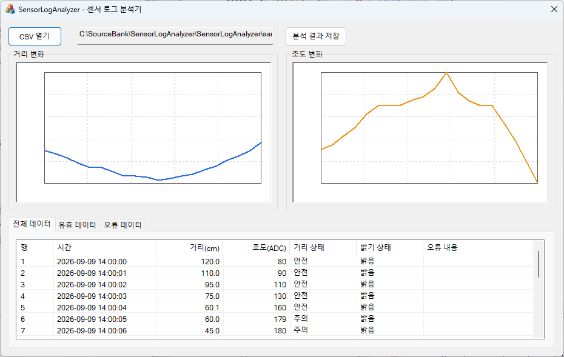

- `sensor_normal.csv`: 유효한 20개 거리·조도 값 표시

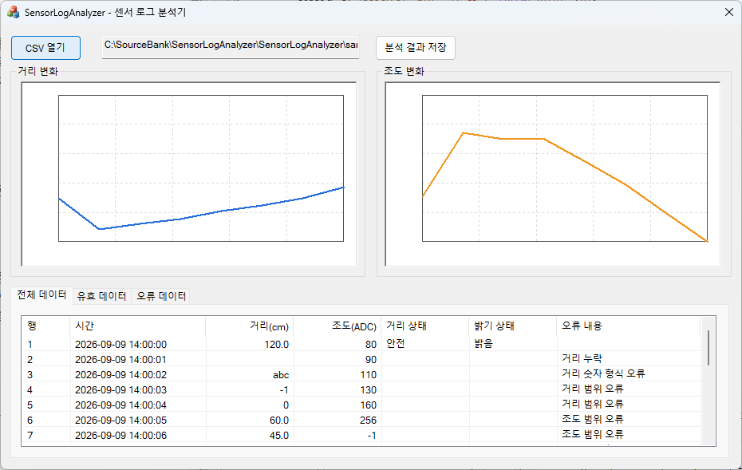

- `sensor_errors.csv` 초기 구현: 오류 행을 제외하고 유효한 8개 값을 이어서 표시

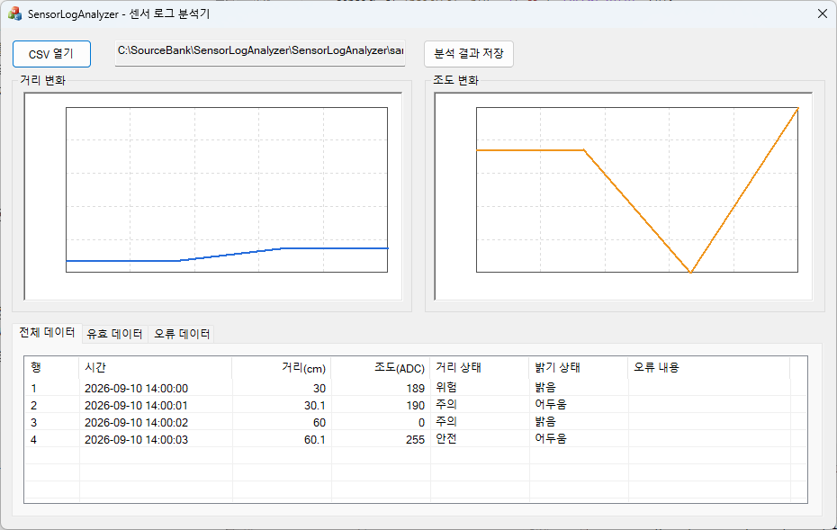

- `sensor_boundaries.csv`: 경계값 4개의 판정 결과와 그래프 표시

### 2026-09-11 — 세로축 눈금과 오류 구간 표현

- 거리 그래프에 `400`, `320`, `240`, `160`, `80`, `0` 눈금 표시
- 조도 그래프에 `255`, `204`, `153`, `102`, `51`, `0` 눈금 표시
- 거리·조도 Group Box 제목에 각각 `(cm)`, `(ADC)` 단위 표시
- 오류 행을 삭제하지 않고 `quiet_NaN()` 값으로 그래프 배열에 유지
- `std::isfinite()`로 오류 위치를 검출하고 다음 유효값부터 새 선을 시작
- 정상·경계값 샘플의 선은 연속으로 표시되고 오류 샘플의 누락 구간은 끊어진 것을 실행 화면에서 확인
- 다음 작업: 가로축에 측정 시각 또는 샘플 위치 표시

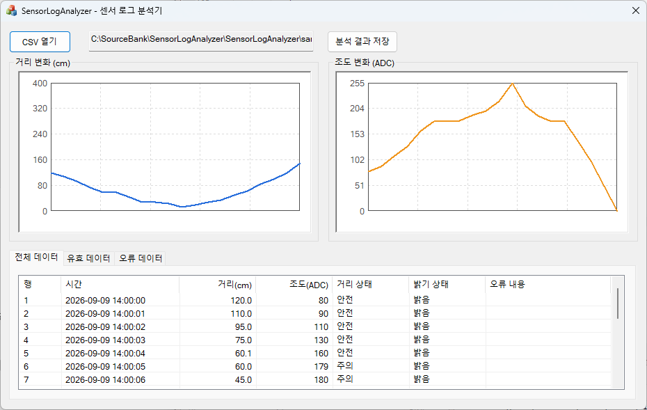

- `sensor_normal.csv`: 고정 범위 세로축과 연속된 거리·조도 선

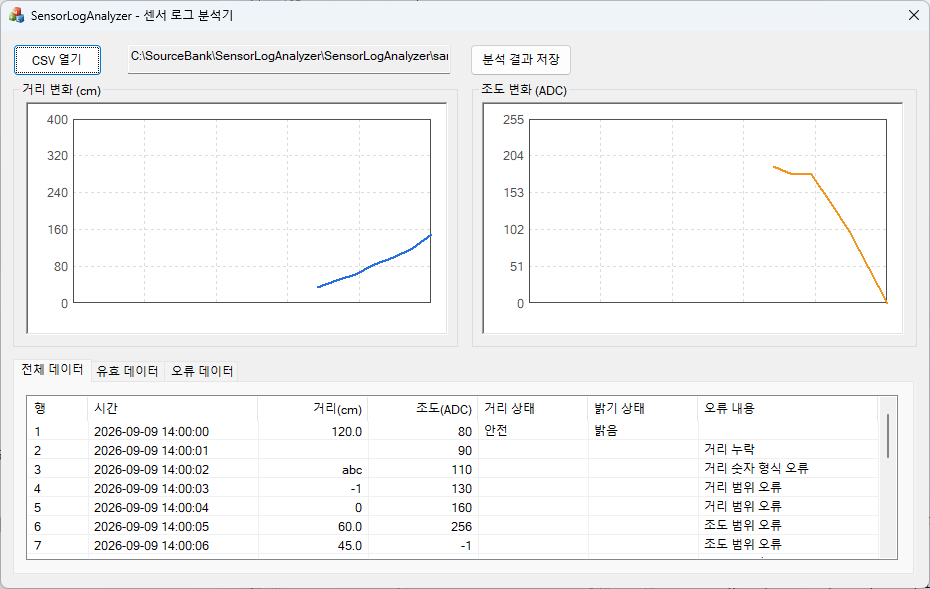

- `sensor_errors.csv`: 오류가 연속된 구간에서 두 그래프의 선이 끊어진 모습

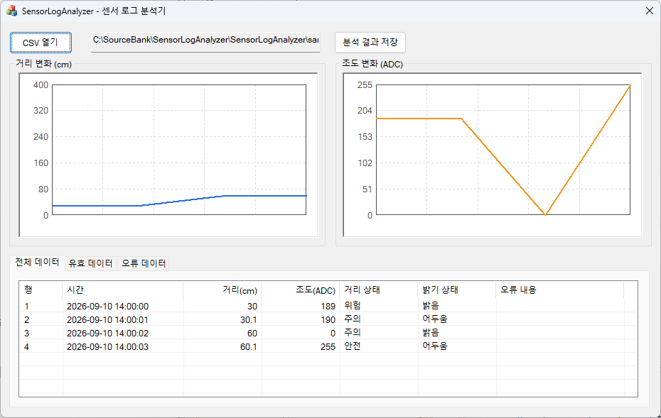

- `sensor_boundaries.csv`: 거리·조도 경계값 4개와 세로축 눈금

### 2026-09-11 — 가로축 측정 시각 표시

- 그래프 데이터와 같은 길이의 `std::vector<CString>` 시간 레이블 추가
- 정상적인 `yyyy-MM-dd HH:mm:ss` 값에서 `HH:mm:ss`만 추출
- 제한된 그래프 폭을 고려해 처음·중간·마지막의 최대 3개 레이블만 표시
- 첫 레이블은 왼쪽, 중간 레이블은 중앙, 마지막 레이블은 오른쪽에 정렬
- 데이터가 한 행뿐이어도 인덱스 계산에서 0으로 나누지 않도록 분기 처리
- `DrawItem()` 종료 전에 기존 GDI 펜과 브러시를 복원하도록 수정
- Debug x64 빌드 성공
- 실행 화면 캡처는 개발자 확인 후 추가 예정

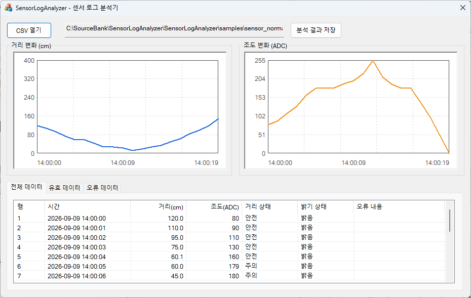

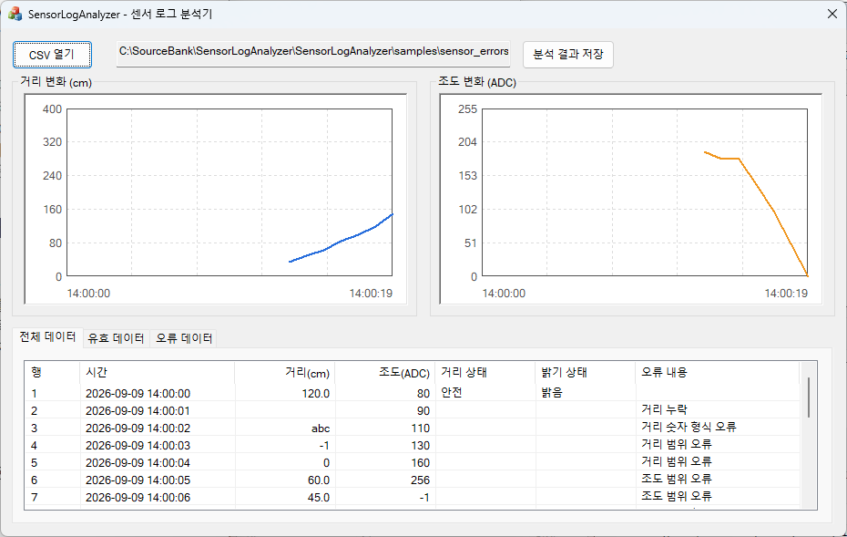

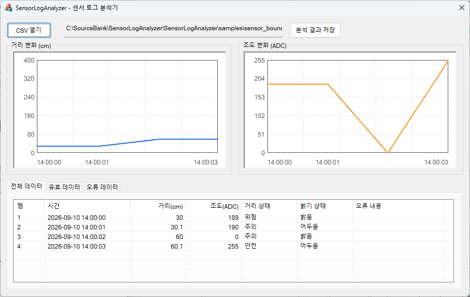


각 단계가 끝나면 구현 기능, 확인한 동작, 발견한 문제와 해결 방법, 실제 화면 캡처를 이 문서에 추가합니다. 코드 작성 여부와 동작 확인 여부를 구분하여 기록합니다.
